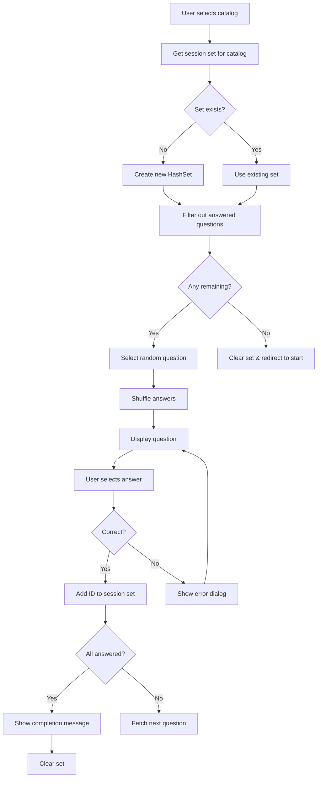

# Learning Trainer - Implementation Architecture Plan

## Project Overview

A web-based quiz application built with Spring Boot 4.0.1, Java 21, and Thymeleaf that tests users on two question catalogs (UBI and SRC) with randomized questions and shuffled answers.

## Technology Stack

- **Backend**: Spring Boot 4.0.1 with Java 21
- **Web Framework**: Spring MVC with embedded Tomcat
- **Template Engine**: Thymeleaf
- **JSON Processing**: Jackson (included in Spring Boot)
- **Container**: Docker with multi-stage build
- **Java Features**: Virtual threads, Records

## Current Project Analysis

### Existing Files
- ✅ [`pom.xml`](../pom.xml) - Spring Boot project descriptor
- ✅ [`LearningTrainerApplication.java`](../src/main/java/de/borowski/trainer/LearningTrainerApplication.java) - Main application class
- ✅ [`UBI-Fragenkatalog.json`](../src/main/resources/UBI-Fragenkatalog.json) - 130 questions dataset
- ✅ [`SRC-Fragenkatalog.json`](../src/main/resources/SRC-Fragenkatalog.json) - 130 questions dataset
- ✅ [`application.properties`](../src/main/resources/application.properties) - Basic configuration

### POM.xml Review

**Current Dependencies:**
- ✅ spring-boot-starter-thymeleaf
- ✅ spring-boot-starter-webmvc
- ⚠️ spring-boot-docker-compose (optional, not needed for our use case)
- ⚠️ Missing: Lombok (recommended but optional)

**Recommendation:** The current dependencies are sufficient. Jackson is included transitively through spring-boot-starter-web.

## Data Model Architecture

### JSON Structure Analysis

Both JSON files follow this structure:
```json
{
  "id": "string",
  "question": "string",
  "answers": [
    {
      "text": "string",
      "is_correct": boolean
    }
  ]
}
```

### Proposed Java Records

```java
// File: src/main/java/de/borowski/trainer/model/Answer.java
public record Answer(
    String text,
    boolean isCorrect
) {}

// File: src/main/java/de/borowski/trainer/model/Question.java
public record Question(
    String id,
    String question,
    List<Answer> answers
) {}

// File: src/main/java/de/borowski/trainer/model/QuestionType.java
public enum QuestionType {
    UBI("UBI-Fragenkatalog.json"),
    SRC("SRC-Fragenkatalog.json");
    
    private final String filename;
    
    QuestionType(String filename) {
        this.filename = filename;
    }
    
    public String getFilename() {
        return filename;
    }
}
```

## Service Layer Architecture

### 1. QuestionLoader Service

**Responsibility:** Load and parse JSON files at application startup

```java
// File: src/main/java/de/borowski/trainer/service/QuestionLoader.java
@Service
public class QuestionLoader {
    
    private final Map<QuestionType, List<Question>> questionsCache = new EnumMap<>();
    
    @PostConstruct
    public void loadQuestions() {
        // Load both JSON files using ObjectMapper
        // Cache in memory for fast access
    }
    
    public List<Question> getQuestions(QuestionType type) {
        return questionsCache.get(type);
    }
}
```

### 2. QuizService

**Responsibility:** Business logic for quiz management

```java
// File: src/main/java/de/borowski/trainer/service/QuizService.java
@Service
public class QuizService {
    
    private final QuestionLoader questionLoader;
    
    // Get random question not in answered set
    public Question getRandomQuestion(QuestionType type, Set<String> answeredIds);
    
    // Shuffle answers to randomize order
    public Question shuffleAnswers(Question question);
    
    // Check if answer is correct
    public boolean checkAnswer(String questionId, int answerIndex, QuestionType type);
    
    // Check if all questions answered
    public boolean isQuizComplete(QuestionType type, Set<String> answeredIds);
}
```

## Controller Architecture

### LearningController Routes

```java
// File: src/main/java/de/borowski/trainer/controller/LearningController.java
@Controller
public class LearningController {
    
    @GetMapping("/")
    public String start() {
        // Returns start.html
    }
    
    @GetMapping("/quiz")
    public String quiz(
        @RequestParam QuestionType type,
        HttpSession session,
        Model model
    ) {
        // Get or create session set of answered questions
        // Get random unanswered question
        // Add to model and return query.html
    }
    
    @PostMapping("/quiz/check")
    @ResponseBody
    public ResponseEntity<CheckResponse> checkAnswer(
        @RequestBody CheckRequest request,
        HttpSession session
    ) {
        // Validate answer
        // Update session if correct
        // Return JSON: { "correct": boolean, "completed": boolean }
    }
}
```

### DTOs

```java
// File: src/main/java/de/borowski/trainer/dto/CheckRequest.java
public record CheckRequest(
    String questionId,
    int answerIndex,
    QuestionType type
) {}

// File: src/main/java/de/borowski/trainer/dto/CheckResponse.java
public record CheckResponse(
    boolean correct,
    boolean completed,
    String message
) {}
```

## Session Management Strategy

### HttpSession Attributes

```java
// Session attribute keys
public class SessionAttributes {
    public static final String UBI_ANSWERED_IDS = "ubi_answered";
    public static final String SRC_ANSWERED_IDS = "src_answered";
}
```

### Logic Flow



## UI/UX Architecture

### Start Mask (start.html)

**Layout:**
```
┌─────────────────────────────────┐
│                                 │
│    Learning Trainer             │
│                                 │
│  ┌───────────────────────────┐  │
│  │                           │  │
│  │   UBI Fragenkatalog       │  │
│  │                           │  │
│  └───────────────────────────┘  │
│                                 │
│  ┌───────────────────────────┐  │
│  │                           │  │
│  │   SRC Fragenkatalog       │  │
│  │                           │  │
│  └───────────────────────────┘  │
│                                 │
└─────────────────────────────────┘
```

**Thymeleaf Template Structure:**
```html
<!DOCTYPE html>
<html xmlns:th="http://www.thymeleaf.org">
<head>
    <title>Learning Trainer - Start</title>
    <link rel="stylesheet" th:href="@{/css/style.css}">
</head>
<body>
    <div class="container">
        <h1>Learning Trainer</h1>
        <div class="button-container">
            <a th:href="@{/quiz(type='UBI')}" class="btn btn-primary">
                UBI Fragenkatalog
            </a>
            <a th:href="@{/quiz(type='SRC')}" class="btn btn-primary">
                SRC Fragenkatalog
            </a>
        </div>
    </div>
</body>
</html>
```

### Query Mask (query.html)

**Layout:**
```
┌─────────────────────────────────┐
│  Question: [Question text]      │
│                                 │
│  ○ Answer 1                     │
│  ○ Answer 2                     │
│  ○ Answer 3                     │
│  ○ Answer 4                     │
│                                 │
│        [Check] (disabled)       │
│                                 │
└─────────────────────────────────┘
```

**Thymeleaf Template Structure:**
```html
<!DOCTYPE html>
<html xmlns:th="http://www.thymeleaf.org">
<head>
    <title>Quiz - Learning Trainer</title>
    <link rel="stylesheet" th:href="@{/css/style.css}">
</head>
<body>
    <div class="container">
        <h2 th:text="${question.question}">Question text</h2>
        
        <form id="quizForm">
            <input type="hidden" id="questionId" th:value="${question.id}">
            <input type="hidden" id="questionType" th:value="${type}">
            
            <div class="answers">
                <div th:each="answer, iterStat : ${question.answers}" class="answer-option">
                    <input type="radio" 
                           th:id="'answer' + ${iterStat.index}"
                           name="answer" 
                           th:value="${iterStat.index}">
                    <label th:for="'answer' + ${iterStat.index}" 
                           th:text="${answer.text}">
                        Answer text
                    </label>
                </div>
            </div>
            
            <button type="button" id="checkBtn" disabled class="btn btn-primary">
                Check
            </button>
        </form>
    </div>
    
    <script th:src="@{/js/quiz.js}"></script>
</body>
</html>
```

### JavaScript Logic (quiz.js)

```javascript
// File: src/main/resources/static/js/quiz.js

document.addEventListener('DOMContentLoaded', function() {
    const checkBtn = document.getElementById('checkBtn');
    const radioButtons = document.querySelectorAll('input[name="answer"]');
    
    // Enable check button when answer selected
    radioButtons.forEach(radio => {
        radio.addEventListener('change', function() {
            checkBtn.disabled = false;
        });
    });
    
    // Handle check button click
    checkBtn.addEventListener('click', function() {
        const selectedAnswer = document.querySelector('input[name="answer"]:checked');
        if (!selectedAnswer) return;
        
        const request = {
            questionId: document.getElementById('questionId').value,
            answerIndex: parseInt(selectedAnswer.value),
            type: document.getElementById('questionType').value
        };
        
        fetch('/quiz/check', {
            method: 'POST',
            headers: {
                'Content-Type': 'application/json'
            },
            body: JSON.stringify(request)
        })
        .then(response => response.json())
        .then(data => {
            if (data.correct) {
                if (data.completed) {
                    alert('Congratulations! You have completed all questions!');
                    window.location.href = '/';
                } else {
                    window.location.href = '/quiz?type=' + request.type;
                }
            } else {
                alert('Wrong answer! Please try again.');
            }
        });
    });
});
```

### CSS Styling (style.css)

```css
/* File: src/main/resources/static/css/style.css */

* {
    margin: 0;
    padding: 0;
    box-sizing: border-box;
}

body {
    font-family: -apple-system, BlinkMacSystemFont, 'Segoe UI', Roboto, sans-serif;
    background: linear-gradient(135deg, #667eea 0%, #764ba2 100%);
    min-height: 100vh;
    display: flex;
    justify-content: center;
    align-items: center;
}

.container {
    background: white;
    border-radius: 12px;
    padding: 2rem;
    max-width: 600px;
    width: 90%;
    box-shadow: 0 20px 60px rgba(0,0,0,0.3);
}

h1, h2 {
    text-align: center;
    color: #333;
    margin-bottom: 2rem;
}

.button-container {
    display: flex;
    flex-direction: column;
    gap: 1rem;
}

.btn {
    padding: 1rem 2rem;
    font-size: 1.1rem;
    border: none;
    border-radius: 8px;
    cursor: pointer;
    text-decoration: none;
    text-align: center;
    transition: all 0.3s ease;
}

.btn-primary {
    background: #667eea;
    color: white;
}

.btn-primary:hover:not(:disabled) {
    background: #5568d3;
    transform: translateY(-2px);
    box-shadow: 0 4px 12px rgba(102, 126, 234, 0.4);
}

.btn:disabled {
    background: #ccc;
    cursor: not-allowed;
}

.answers {
    margin: 2rem 0;
}

.answer-option {
    padding: 1rem;
    margin: 0.5rem 0;
    border: 2px solid #e0e0e0;
    border-radius: 8px;
    cursor: pointer;
    transition: all 0.2s ease;
}

.answer-option:hover {
    border-color: #667eea;
    background: #f5f7ff;
}

.answer-option input[type="radio"] {
    margin-right: 1rem;
    cursor: pointer;
}

.answer-option label {
    cursor: pointer;
    user-select: none;
}
```

## Docker Configuration

### Multi-stage Dockerfile

```dockerfile
# File: Dockerfile

# Stage 1: Build
FROM maven:3.9.6-eclipse-temurin-21 AS build
WORKDIR /app
COPY pom.xml .
COPY src ./src
RUN mvn clean package -DskipTests

# Stage 2: Runtime
FROM eclipse-temurin:21-jre-jammy
WORKDIR /app
COPY --from=build /app/target/*.jar app.jar

# Enable virtual threads
ENV JAVA_TOOL_OPTIONS="-XX:+UseVirtualThreads"

EXPOSE 8080

ENTRYPOINT ["java", "-jar", "app.jar"]
```

### Docker Compose (Optional)

```yaml
# File: docker-compose.yml
version: '3.8'

services:
  learning-trainer:
    build: .
    ports:
      - "8080:8080"
    environment:
      - SPRING_PROFILES_ACTIVE=prod
    restart: unless-stopped
```

## Application Configuration

### Enhanced application.properties

```properties
# File: src/main/resources/application.properties
spring.application.name=LearningTrainer

# Server configuration
server.port=8080

# Thymeleaf configuration
spring.thymeleaf.cache=false
spring.thymeleaf.prefix=classpath:/templates/
spring.thymeleaf.suffix=.html

# Session configuration
server.servlet.session.timeout=30m
server.servlet.session.cookie.name=LEARNING_TRAINER_SESSION

# Jackson configuration for snake_case JSON
spring.jackson.property-naming-strategy=SNAKE_CASE

# Logging
logging.level.de.borowski.trainer=INFO
```

## Implementation Best Practices

### 1. Error Handling

```java
@ControllerAdvice
public class GlobalExceptionHandler {
    
    @ExceptionHandler(NoSuchElementException.class)
    public String handleNoQuestions(Model model) {
        model.addAttribute("error", "No questions available");
        return "error";
    }
}
```

### 2. Validation

- Validate `QuestionType` parameter in controller
- Check for null/empty sessions
- Validate answer index bounds

### 3. Testing Strategy

```java
@SpringBootTest
class QuizServiceTest {
    
    @Test
    void testRandomQuestionSelection() {
        // Test randomization logic
    }
    
    @Test
    void testAnswerShuffling() {
        // Test answer shuffling
    }
    
    @Test
    void testAnswerValidation() {
        // Test correct/incorrect answer detection
    }
}
```

## Security Considerations

1. **CSRF Protection**: Spring Security enabled by default (consider for production)
2. **Session Fixation**: Spring handles automatically
3. **Input Validation**: Validate all user inputs
4. **XSS Protection**: Thymeleaf escapes by default

## Performance Optimizations

1. **Question Caching**: Load JSON files once at startup
2. **Virtual Threads**: Java 21 virtual threads for concurrent requests
3. **Static Resource Caching**: Configure browser caching for CSS/JS
4. **Session Management**: Use in-memory sessions (default)

## Deployment Instructions

### Local Development

```bash
# Run with Maven
./mvnw spring-boot:run

# Run with Java
./mvnw clean package
java -jar target/trainer-0.0.1-SNAPSHOT.jar
```

### Docker Deployment

```bash
# Build image
docker build -t learning-trainer:latest .

# Run container
docker run -p 8080:8080 learning-trainer:latest

# Or use docker-compose
docker-compose up -d
```

### Production Considerations

1. Enable HTTPS/TLS
2. Configure external session store (Redis) for scaling
3. Add health check endpoints
4. Configure logging aggregation
5. Set up monitoring (Prometheus/Grafana)

## File Structure Summary

```
LearningTrainer/
├── src/
│   ├── main/
│   │   ├── java/de/borowski/trainer/
│   │   │   ├── LearningTrainerApplication.java
│   │   │   ├── controller/
│   │   │   │   └── LearningController.java
│   │   │   ├── service/
│   │   │   │   ├── QuestionLoader.java
│   │   │   │   └── QuizService.java
│   │   │   ├── model/
│   │   │   │   ├── Answer.java
│   │   │   │   ├── Question.java
│   │   │   │   └── QuestionType.java
│   │   │   ├── dto/
│   │   │   │   ├── CheckRequest.java
│   │   │   │   └── CheckResponse.java
│   │   │   └── config/
│   │   │       └── SessionAttributes.java
│   │   └── resources/
│   │       ├── application.properties
│   │       ├── UBI-Fragenkatalog.json
│   │       ├── SRC-Fragenkatalog.json
│   │       ├── templates/
│   │       │   ├── start.html
│   │       │   └── query.html
│   │       └── static/
│   │           ├── css/
│   │           │   └── style.css
│   │           └── js/
│   │               └── quiz.js
│   └── test/
│       └── java/de/borowski/trainer/
│           └── QuizServiceTest.java
├── Dockerfile
├── docker-compose.yml
├── pom.xml
└── README.md
```

## Next Steps

1. Review this architecture plan
2. Confirm approach and make any adjustments
3. Begin implementation following the todo list
4. Test incrementally after each phase
5. Deploy to Docker container

---

**Created:** 2026-01-06  
**Version:** 1.0  
**Author:** Architecture Mode
